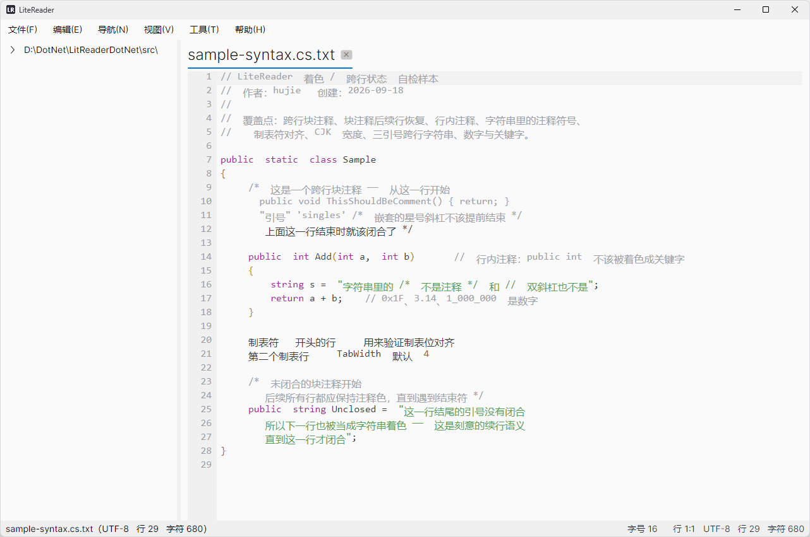
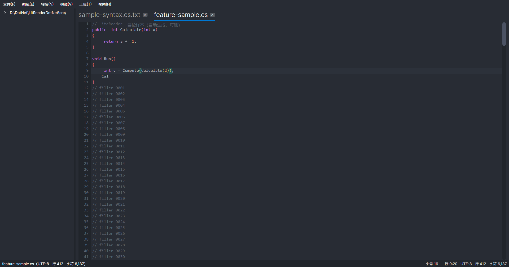

# LiteReader

> 作者：lanjue12138　创建：2026-09-18　最近更新：2026-09-22
> 工程：`src/LiteReader.Avalonia/`（产物名为 `LiteReader`）　开发文档：[DEVELOPMENT.md](DEVELOPMENT.md)

**LiteReader** 是一个 VS Code 风格的**轻量级本地代码阅读 / 编辑工具** —— 打开即看、随开随关，
不卡顿、不占资源，代码着色美观，支持多套深色 / 亮色主题、代码补全与跳转定义。

技术上是一个 **.NET 10 + Avalonia 11.3** 的 XAML / MVVM 桌面应用。渲染策略是
**外壳用框架控件、编辑区自绘** —— 既有现代 UI 框架带来的控件完整度与主题一致性，
又能对十万行级的大文件保持稳定的着色与滚动性能。



*`One Light` 主题。注意系统标题栏、外边框、窗口图标都跟着主题变（不是系统默认的那条白 / 黑边）。*



*`One Dark Pro` 主题。可见彩虹括号（按嵌套深度循环配色）、多标签、代码补全候选、右侧自绘导航条。*

---

## 目录

| 章节 | 内容 |
|---|---|
| [1. 项目简介](#1-项目简介) | 解决什么问题、能力概览、运行环境与开销 |
| [2. 功能特性](#2-功能特性) | 完整功能清单 |
| [3. 使用说明](#3-使用说明) | 菜单、快捷键、操作要点 |
| [4. 支持的语言](#4-支持的语言) | 语言识别规则 |
| [5. 配置文件](#5-配置文件) | 配置路径与内容 |
| [6. 技术栈](#6-技术栈) | 框架、运行时、发布形态、目标 RID |
| [7. 工程结构](#7-工程结构) | 目录与模块职责、关键设计取向 |
| [8. 构建与运行](#8-构建与运行) | 构建、运行、发布、诊断参数 |
| [9. 已知限制](#9-已知限制) | 平台能力矩阵、缩水处与其它限制（如实记录） |
| [10. 现状与路线图](#10-现状与路线图) | 已完成 / 待做 |
| [11. 相关文档](#11-相关文档) | 开发文档与实测记录 |

---

## 1. 项目简介

### 1.1 解决什么问题

「**随手看一眼代码**」这件事不该需要启动一个 IDE：

- 打开即看、随开随关 —— 不为了看一个文件而拉起一整套 IDE
- 老旧机器、**远程桌面**、服务器上也能流畅运行
- 但该有的都有：语法着色、多套主题、彩虹括号、查找、跳转定义、代码补全、轻量编辑

### 1.2 能力概览

| 维度 | 说明 |
|---|---|
| **界面** | 5 套主题（含 AMOLED 纯黑），**系统标题栏与外边框跟随主题** |
| **着色** | 20+ 种语言识别、彩虹括号、括号配对、跨行块注释与字符串续行 |
| **编辑** | 多标签、操作式撤销栈、增量行索引、多编码识别与**原编码回写** |
| **工具** | 查找、跳转定义、代码补全、双击分词高亮、自绘滑动导航条 |
| **桌面集成** | 单实例 + 文件转发、注册为「打开方式」、在文件目录打开终端 |
| **发布** | Windows x64 Native AOT —— `LiteReader.exe` + 3 个原生 dll，共约 **37.4 MiB** |
| **开销** | 启动约 **0.7 s**（进程起 → 窗口可见），工作集约 **139 MB** |

### 1.3 运行环境与开销

| 项 | 值 |
|---|---|
| **操作系统** | **Windows x64**（`win-x64`）。代码本身不依赖平台（平台差异全部收在 `Services/` 下），也可编译到 `linux-x64` / `osx-*`，但**当前只产出 Windows 发布物**，其他平台未经真机验证（见 [§9](#9-已知限制)） |
| **运行时** | .NET 10。以 **Native AOT** 发布，编译产物是原生可执行文件 —— **目标机不需要安装 .NET** |
| **发布物** | **4 个文件**放在同一目录：`LiteReader.exe`（21.6 MiB）+ `libSkiaSharp.dll` / `libHarfBuzzSharp.dll` / `av_libglesv2.dll` |
| **启动** | 约 **0.7 s**（口径：进程起 → 窗口可见） |
| **常驻内存** | 工作集约 **139 MB**，其中约 110 MB 是 **Skia 绘图缓冲 + ANGLE GPU 资源池** |

> 内存里那 110 MB 不是泄漏，但实打实占着 —— 它是「多套主题开箱一致 + 跨平台渲染」的入场费。
> 低配环境下可切软件渲染把私有内存压到 39 MB 左右，代价是文本编辑的滚动手感（未验证），
> 详见《性能评估-2026-09-22.md》§6.2。

---

## 2. 功能特性

### 语法高亮

- 支持 C / C++ / C# / Java / Kotlin / JS / TS / Go / Rust / PHP / Swift / CSS / JSON /
  SQL / Python / HTML / XML / XAML / ASPX 等（完整识别规则见 [§4](#4-支持的语言)）
- **混合语言着色**：HTML/ASPX 里的 `<script>`（JS）、`<style>`（CSS）、ASPX 的 `<% %>` 服务端块分别着色
- **跨行状态机**：块注释 `/* */`、三引号字符串、SQL 的 `BEGIN/END` 在跨行时着色状态正确延续
- **彩虹括号**：`() [] {}` 按嵌套深度循环 **6 色**，**深度跨行**（与块注释共用状态推进）；
  SQL 的 `BEGIN / END / CASE` 当「词括号」参与嵌套与配对
- **括号配对高亮**：光标处的括号高亮其同类型配对项（鼠标点击也算）
- 增量着色 + 按行缓存，只重算可视区与受影响行

### 多套主题（5 套）

`One Dark Pro` / `One Light` / `VS Code Dark` / `IntelliJ IDEA` / `极致黑 AMOLED`，
运行时一键切换（菜单「视图 → 主题」）。

主题覆盖 **18 个语义键**，包括编辑区（正文/关键字/字符串/注释/行号槽/选区/当前行/分词标记/
导航条）与外壳（窗口底色、状态栏、分隔条）以及**系统标题栏与外边框**。
每套主题都给出「亮 / 暗」方向，框架控件（Fluent）的 `ThemeVariant` 会跟着切换，
所以**深色主题下连对话框、右键菜单也是深色的**。

### 编辑

- 光标 / 选区 / 插入删除，鼠标与键盘完整（含 Shift 扩展选区、Home/End、Ctrl+方向键按词移动）
- **操作式撤销栈**：`record struct EditStep(Start, Del, Ins)` —— 撤销 = 删掉它插入的串、填回它删除的串。
  连续输入 / 退格在 700 ms 窗口内自动合并成一步历史
- **脏标记 = 撤销栈深度比较**（不是粘性 bool）—— 撤销回保存点自然变干净
- **增量行索引**：只重切受影响区间 + 尾段整块平移，避免每次按键都全文重扫
- **多编码识别与原编码回写**：UTF-8 / UTF-8 BOM / UTF-16 LE / UTF-16 BE / GBK(936)，
  保存时按**原编码**写回，不破坏文件
- 多标签，重复打开同一文件会聚焦到已有标签（而不是开第二个）

### 查找

顶部查找条（`Ctrl+F`，再按一次收起）：

- `F3` / `Shift+F3` / `Enter` / `Shift+Enter` 循环查找下 / 上一个
- `Aa` 开关切换是否区分大小写
- 增量查找（边打字边定位），状态栏显示「第 n / 共 m 项」

### 跳转定义

`F12` / `Ctrl+单击` / 右键菜单 —— 单文件启发式打分定位函数或变量的定义处
（后跟 `(`、前接声明关键字、前接首字母大写词等加权），区分度可靠（详见 [DEVELOPMENT.md](DEVELOPMENT.md) §7.2）。

### 代码补全（可在菜单里开关）

- 候选来源：**文档内函数名**（扫描「标识符后紧跟 `(`」去重收集）+ **按语言的关键字表**
- **括号 / 引号自动配对**：输入 `() {} [] < > " '` 自动补出配对字符并把光标置于中间；
  选中文本时整体包裹；再次输入右配对字符且其后恰为该字符时跳过，不重复插入
- 自绘候选面板（不抢焦点、随主题配色）：`↑` / `↓` 选择、`Tab` / `Enter` 确认、
  `Esc` 取消、鼠标点击确认；已输入前缀高亮，右侧标 `kw` / `fn` 区分候选类型
- 确认后光标落在补全词之后（关键字 / 类型自动补一个空格）

### 双击分词高亮

双击一个词 → 选中它并**高亮全文所有同词**（在主题里是一个专用的底颜色键）。

- **只收整词命中** —— 双击 `in` 不会点亮 `index` / `inline` 里的 `in`
- **SQL 的 `BEGIN` / `END` / `CASE` 是例外**：不做全文高亮，只选中该词本身
  （几百行的存储过程里几十个 `END` 全点亮等于把正文涂满）
- 命中结果**按行分桶**，渲染时只查当前可视的几十行
- 落在空白 / 标点上时退化为选中相邻一个字符；单击正文即清除高亮

### 右侧滑动导航条

- 滑块高度 = 可视行数占比（**带最小高度**，否则 10 万行时滑块只有 0.3 px）
- 支持按住拖动与点击定位，位置 ↔ 行号互为逆运算
- 同时兼任「当前位置指示」（随光标所在行同步移动）

### 右键菜单

```
复制 / 剪切 / 粘贴  →  ─────  →  全选  →  ─────  →  在命令提示符中打开  →  ─────  →  跳转到定义
```

灰显条件：无选区 → 灰掉复制 / 剪切；剪贴板无文本 → 灰掉粘贴；取不到标识符 → 灰掉跳转定义。
**右键落在已有选区内会保留选区**（否则「选好一段文字 → 右键 → 复制」会发现选区被点没了）。

### 桌面集成

- **单实例 + 文件转发**：命名互斥体判重 + 命名管道转发。
  不依赖窗口系统，**Wayland 下同样可用**；传空列表 = 只把已有窗口叫到前面来。
- **注册为「打开方式」**：「工具 → 注册为『打开方式』…」，
  Windows 走 HKCU 注册表（**不需要管理员**），Linux 写 `.desktop` + 尽力跑 `xdg-mime`，
  macOS 生成可粘贴的 plist 片段与步骤。
  **只加进「打开方式」列表，不抢默认关联** —— 不会顶掉机器上 VS Code / Notepad++ 的设置。
- **在文件所在目录打开终端**：有序尝试候选终端（Win `wt.exe` → `powershell` → `cmd`）；
  目录优先级为「当前文件目录 → 上次打开的文件夹 → 主目录」。

### 外观与交互

- **窗口外框跟随主题**：Windows 11（22000+）下系统标题栏、标题文字、外边框都按主题上色
- **程序图标**：一份图三种用途 —— `.ico` 进 exe 的 PE 资源段（资源管理器 / 任务栏 / Alt+Tab）、
  `.png` 做运行时 `Window.Icon` 与 Linux 图标安装
- **Ctrl + 鼠标滚轮调字号**（每格 ±1 pt，范围 **8~32**）；`Shift + 滚轮` 横向滚动
- 左侧文件夹树：懒加载、隐藏文件、符号链接成环保护
- 配置持久化：窗口几何 / 最大化状态 / 上次文件夹 / 主题 / 字号 / 补全开关 / 查找大小写

---

## 3. 使用说明

### 3.1 菜单

| 菜单 | 项 |
|---|---|
| **文件** | 打开文件…（`Ctrl+O`）/ 打开文件夹…（`Ctrl+Shift+O`）/ 保存（`Ctrl+S`）/ 关闭当前标签（`Ctrl+W`）/ 退出 |
| **编辑** | 撤销 / 重做 / 剪切 / 复制 / 粘贴 / 全选 / 查找…（`Ctrl+F`）/ 查找下一个（`F3`）/ 查找上一个（`Shift+F3`） |
| **导航** | 跳转到定义（`F12`，也可 `Ctrl+单击`） |
| **视图** | 主题（5 套）/ 代码补全开关 / 放大字号 / 缩小字号 / 恢复默认字号 |
| **工具** | 在文件所在目录打开终端（`Ctrl+Alt+T`）/ 注册为「打开方式」… |
| **帮助** | 关于 LiteReader |

### 3.2 快捷键

| 快捷键 | 功能 |
|---|---|
| `Ctrl + O` / `Ctrl + Shift + O` | 打开文件 / 打开文件夹 |
| `Ctrl + S` / `Ctrl + W` | 保存 / 关闭当前标签 |
| `Ctrl + F` | 打开查找条（再按一次收起） |
| `F3` / `Shift + F3` | 查找下一个 / 上一个（**循环**） |
| `Enter` / `Shift + Enter`（查找框内） | 同上 |
| `Esc` | 关闭查找条 / 取消补全候选 |
| `F12` / `Ctrl + 单击` | 跳转到定义 |
| `↑` / `↓` | 补全候选上下选择（无候选时为光标上下移动） |
| `Tab` / `Enter` | 确认补全候选 |
| `Ctrl + Z` / `Ctrl + Y`（或 `Ctrl+Shift+Z`） | 撤销 / 重做 |
| `Ctrl + A` / `C` / `X` / `V` | 全选 / 复制 / 剪切 / 粘贴 |
| `Ctrl + 鼠标滚轮` | **调字号**（每格 ±1 pt，范围 8~32） |
| `Shift + 鼠标滚轮` | 横向滚动 |
| `鼠标滚轮` | 垂直滚动（每格 3 行） |
| `Ctrl + Alt + T` | 在文件所在目录打开终端 |
| `双击` / `三击` | 选中整词并**高亮全文同词** / 选中整行 |
| `右键` | 编辑菜单（复制 / 剪切 / 粘贴 / 全选 / 在命令提示符中打开 / 跳转到定义） |
| `拖动右侧滑块` | 跳转到文档任意位置 |

> **滚轮的三种组合是有优先级的**：`Ctrl` 分支排在 `Shift` 之前 ——
> `Ctrl+Shift+滚轮` 会同时满足两个条件，而「按住 Ctrl 想调字号」是更明确的意图，
> 不该被横向滚动抢走。

### 3.3 操作要点

- **打开文件夹**后左侧出现文件夹树，点击文件即以新标签打开，当前文件高亮。
- **双击单词**高亮全文同词，**单击正文任意处**清除。
- **跳转定义**的落点是「光标所在标识符，或选区里的词」。
- **代码补全**在「视图」菜单里开关，默认开启；关闭后括号/引号也不再自动配对。
- **字号**的改动会立即落盘，下次启动自动恢复。

---

## 4. 支持的语言

语言识别**只看文件扩展名**（不做内容嗅探 —— 嗅探准确率提升有限，还要每次载入多扫一遍文件，
且行为难以解释）。未知扩展名一律按纯文本处理：**宁可少给功能，也不要给错的。**

| 模式 | 扩展名 | 特殊行为 |
|---|---|---|
| **SQL** | `.sql` `.ddl` `.dml` `.pks` `.pkb` | `BEGIN` / `END` / `CASE` 当块括号（参与嵌套深度与配对高亮） |
| **Python** | `.py` `.pyw` `.pyi` | 三引号块字符串着色；独立的补全词表 |
| **标记语言** | `.html` `.htm` `.xhtml` `.xml` `.xaml` `.axaml` `.aspx` `.ascx` `.cshtml` `.vbhtml` `.svg` `.xsd` `.xsl` `.config` `.csproj` `.props` `.targets` `.resx` `.plist` | 标签着色；`<script>`(JS) / `<style>`(CSS) / `<% %>` 分别着色 |
| **C 族** | `.cs` `.c` `.h` `.cpp` `.cc` `.cxx` `.hpp` `.hh` `.hxx` `.java` `.kt` `.kts` `.js` `.mjs` `.cjs` `.jsx` `.ts` `.tsx` `.go` `.rs` `.css` `.scss` `.less` `.php` `.swift` `.m` `.mm` `.json` `.jsonc` | 通用关键字 + 括号自动配对 |
| **纯文本** | 其它 | 不做块括号；补全只给文档内函数名 |

> **为什么着色用的关键字集是合并的（所有语言并成一张表），而不是逐语言拆开**：
> 合并集对判色已经足够，而拆成 6–8 份词表意味着要维护多份数据并在扫描里按语言分支 ——
> 改动面和回归风险都不小，收益只有「个别同形词的判色更准」。这个权衡不划算。
> 真正必须按语言区分的只有两处：**块括号语义**与**补全词表**，这两处已经按上面的模式分开了。

---

## 5. 配置文件

配置为 **JSON**，存放位置遵循各平台惯例 ——
不写注册表，也不写 exe 同目录（后者在 Linux/macOS 上通常只读）。

| 平台 | 路径 |
|---|---|
| Windows | `%APPDATA%\LiteReader\config.json` |
| Linux | `$XDG_CONFIG_HOME/lite-reader/config.json`（无该变量时回落 `~/.config/lite-reader/`） |
| macOS | `~/Library/Application Support/LiteReader/config.json` |

配置内容：主题、字号、制表宽、代码补全开关、查找区分大小写、
窗口位置 / 尺寸 / 最大化状态、上次打开的文件夹。

> **配置坏了不会让程序起不来** —— 解析失败就当没有配置、用默认值继续；
> 写盘失败（无权限 / 磁盘满）静默忽略，配置丢失不是致命错误。

---

## 6. 技术栈

| 项 | 选择 | 说明 |
|---|---|---|
| UI 框架 | **Avalonia 11.3.22** | 跨平台 XAML 框架 |
| 语言 / 运行时 | **C# 13 / .NET 10** | `net10.0` |
| UI 写法 | **XAML + MVVM**（CommunityToolkit.Mvvm 8.x） | 编译期绑定（`AvaloniaUseCompiledBindingsByDefault`） |
| 渲染策略 | 外壳用框架控件，编辑区自绘 | 自绘控件 = `Control.Render(DrawingContext)` |
| 配置格式 | `System.Text.Json` **源生成器** | 裁剪下零告警（不能用反射版） |
| 字体 | `Avalonia.Fonts.Inter` + 系统等宽字体回退链 | `Consolas, Menlo, DejaVu Sans Mono, …, Microsoft YaHei, PingFang SC, Noto Sans CJK SC` |
| 发布形态 | **Windows x64 Native AOT** | `LiteReader.exe` + 3 个原生 dll，由 `publish-aot.ps1` 产出到 `dist-win-x64\` |
| 裁剪 | `PublishTrimmed=true` + `TrimMode=partial` | 两者必须一起写；只写 `TrimMode` 不会打开裁剪（见 csproj 注释） |

**目标 RID**

| 平台 | RID | 图形后端 | 是否出发布物 |
|---|---|---|---|
| **Windows** | **`win-x64`** | Win32 + ANGLE | ✅ **当前唯一发布目标** |
| Windows | `win-arm64` | Win32 + ANGLE | 代码可编译，需在 arm64 机器上出产物 |
| Linux | `linux-x64` / `linux-arm64` | X11 / Wayland | 代码可编译，当前不出产物（未真机验证） |
| macOS | `osx-x64` / `osx-arm64` | Avalonia.Native（Cocoa） | 代码可编译，当前不出产物（未真机验证） |

Avalonia 的 `UsePlatformDetect()` 自动选后端，**业务代码里不需要任何平台判断**。

---

## 7. 工程结构

```
src/LiteReader.Avalonia/
├── LiteReader.Avalonia.csproj    net10.0 / WinExe / PublishTrimmed+TrimMode=partial / ApplicationIcon
├── publish-aot.ps1               Native AOT 发布脚本（唯一被验证过的发布方式）
├── Program.cs                    入口 · AppBuilder · 无窗口诊断提前返回 · 单实例门禁
├── App.axaml(.cs)                应用装配 · 配置载入 · 命令行文件参数 · 单实例接收端
├── Assets/                       appicon.ico（→ PE 资源段）+ icon.png（→ Window.Icon / Linux 图标）
├── Models/                       ── 纯逻辑，可单测 ──
│   ├── DocumentModel.cs          文本 + 增量行索引 + 操作式撤销栈 + 跨行着色状态 + 函数名索引
│   ├── SyntaxHighlighter.cs      逐行分词着色 + 彩虹括号 + SQL 词括号
│   ├── LanguageMode.cs           按扩展名判语言
│   ├── BracketMatcher.cs         括号配对（含 SQL 的 BEGIN/END/CASE）
│   ├── TextSearch.cs             查找（循环 / 计数 / 序号）
│   ├── DefinitionFinder.cs       跳转定义（启发式打分）
│   ├── CompletionEngine.cs       补全候选（文档内函数名 + 关键字表）
│   ├── WordMarker.cs             双击分词高亮（整词边界 + 按行分桶）
│   └── OverviewBar.cs            导航条几何（滑块 ↔ 首行的互逆换算）
├── Services/                     ── 平台差异全部收在这里 ──
│   ├── ThemeService.cs           5 套主题切换 + 配色查询 + 取色（供 DWM 用）
│   ├── AppConfig.cs              配置持久化（XDG 目录 + JSON 源生成器）
│   ├── EditorSettings.cs         全局字号 / 制表宽 / 补全开关（静态单例 + 事件广播）
│   ├── StartupFiles.cs           启动参数分类（诊断开关 / 真实存在的文件路径）
│   ├── WindowChrome.cs           窗口外框跟随主题（DWM 四属性）
│   ├── SingleInstance.cs         单实例 + 文件转发（命名互斥体 + 命名管道）
│   ├── FileAssociation.cs        注册为「打开方式」（Win 注册表 / Linux .desktop / macOS 说明）
│   └── TerminalLauncher.cs       在文件所在目录打开终端（三平台候选清单 + 有序尝试）
├── ViewModels/                   标签 / 文件树 / 主窗口（标签·主题·查找·工具·状态栏）
├── Views/
│   ├── MainWindow.axaml(.cs)     外壳：菜单 + 文件树 + 标签栏 + 查找条 + 状态栏
│   └── EditorSurface.cs          自绘可编辑编辑器：行号槽 · 分段着色 · 配对高亮 ·
│                                 分词标记底色 · 右侧导航条 · 自绘补全面板 · 右键菜单 ·
│                                 键盘/输入/剪贴板/滚轮内核 · 括号自动配对
├── Themes/                       5 套配色 ResourceDictionary（18 个语义键）+ 分区类工厂
└── docs/screenshots/             本 README 用的截图
```

**几个关键设计取向**

- **编辑区自绘、外壳用控件** —— 框架自带的文本控件撑不住大文件（`RichTextBox` 载入 19.3 MB
  要 2886 ms 且呈超线性），编辑器需要的分段着色、行号槽、当前行高亮、脏矩形增量重绘、
  自绘导航条与补全面板它也不提供。实测依据见 [DEVELOPMENT.md](DEVELOPMENT.md) §6。
- **主题与字号走静态单例 + 事件广播**（`ThemeService.Changed` / `EditorSettings.Changed`）：
  自绘控件挂载时订阅、卸载时退订。好处是 XAML 里不用写长绑定，模板层保持干净。
- **文件对话框能力由 View 注入给 ViewModel**：VM 因此不依赖 `TopLevel` / `StorageProvider`，可单测。
- **平台判断只出现在 `Services/` 的三个文件里**，ViewModel 与 XAML 里一句都没有。
- **主题字典用静态分区类**（而不是运行时动态加载 XAML）：换主题只需换一个字典实例，
  新增主题不用改 XAML，同时消除裁剪告警。

---

## 8. 构建与运行

**环境要求**：.NET SDK 10（本工程在 10.0.401 上验证）+
**带 C++ 工具链的 Visual Studio**（Native AOT 需要 `link.exe` 与 Windows SDK 的库目录）。

```powershell
# 开发构建
dotnet build src/LiteReader.Avalonia/LiteReader.Avalonia.csproj -c Release

# 直接运行（可带文件路径）
dotnet run --project src/LiteReader.Avalonia -- <可选的文件路径>

# 发布（推荐，也是唯一被验证过的发布方式）
powershell -ExecutionPolicy Bypass -File src/LiteReader.Avalonia/publish-aot.ps1
#   -> src/LiteReader.Avalonia/dist-win-x64/
#        LiteReader.exe  libSkiaSharp.dll  libHarfBuzzSharp.dll  av_libglesv2.dll   (37.4 MiB)
```

> ★ **不要手写 `dotnet publish -p:PublishAot=true`** —— 在本机会失败，而且报错不会直接指向真正的原因。
> `publish-aot.ps1` 已经处理掉这两件事（细节写在脚本头部注释）：
>
> 1. **工具链发现走不通**：ILC 默认调用自带的 `findvcvarsall.bat`，
>    它内部会 `call vcvarsall.bat` → `reg.exe`，而**本机安全策略禁止启动 `reg.exe`**。
>    脚本改为自己推导 MSVC / Windows SDK 路径 + `-p:IlcUseEnvironmentalTools=true`。
>    缺了 Windows SDK 的 `um\x64` 时症状是链接期 `LNK1181: cannot open input file "advapi32.lib"`。
> 2. **AOT 的中间产物默认落在 `bin\...\win-x64\native\`**，里面那个 exe 旁边没有那 3 个原生 dll，
>    **双击必崩**（`DllNotFoundException: Unable to load DLL 'libSkiaSharp'`）。
>    **永远不要运行或分发 `native\` 目录里的东西**；脚本用 `-p:NativeOutputPath=` 把中间产物改到
>    `obj\aot-native\`，从根上不生成这个目录。

脚本还能顺带做两件容易忘的事：

- 发布结束时删掉历史遗留的 `bin\...\native\`（如果存在）；
- **重建托管 apphost** —— `PublishAot=true` 会关掉 `UseAppHost`，把
  `bin\...\win-x64\LiteReader.exe`（`dotnet run` / 调试用的那个）删掉；
  脚本会在发布后 `dotnet build` 一次把它恢复，避免「发布一次，调试的 exe 就消失了」。

可选参数：

| 参数 | 作用 |
|---|---|
| `-OutDir <dir>` | 指定产物目录（默认 `dist-<rid>`） |
| `-Speed` | 加 `-p:OptimizationPreference=Speed`（开 VxSort）。**实测代价 +1.9 MiB，收益尚未测量**，故默认关闭 |
| `-KeepNativeIntermediates` | 保留 `obj\aot-native\`（默认保留；此开关对旧路径 `bin\native\` 有效） |
| `-SkipRestoreManagedAppHost` | 不重建托管 apphost |

### 8.1 命令行用法

```bash
LiteReader.exe                     # 空窗口启动
LiteReader.exe path/to/file.cs     # 直接打开文件
```

程序**已经在运行时再次启动不会开出第二个进程** —— 路径会转发给已有窗口，然后新进程自己退出。

### 8.2 诊断参数（开发用）

内置三个不需要人工操作的诊断模式：

| 参数 | 作用 | 需要窗口 |
|---|---|---|
| `--fuzz <n>` | 差分模糊对拍：把编辑操作逐步与行索引 / 着色状态对拍 | 否 |
| `--bench-edit` | 编辑内核性能基准 | 否 |
| `--selftest` | 视觉回归 + 逻辑断言 + 真实控件上的闭环 | **是** |

诊断参数会**绕开单实例门禁**（否则「程序已开着时再跑诊断」会被转发出去、然后自己退出），
也不会覆盖你保存的配置。细节见 [DEVELOPMENT.md](DEVELOPMENT.md) §5。

---

## 9. 已知限制

### 9.1 平台能力现状

| 能力 | Windows | Linux | macOS |
|---|---|---|---|
| 文件对话框 / 编码识别 / 配置持久化 | ✅ | ✅ | ✅ |
| 字体回退链 | ✅ | ✅ | ✅ |
| 单实例 + 文件转发（命名互斥体 + 命名管道） | ✅ | ✅ | ✅ |
| 注册为「打开方式」 | ✅ HKCU 注册表，**不需要管理员** | ✅ `.desktop` + 尽力跑 `xdg-mime` | ⚠️ 只生成可粘贴的 plist 片段 + 步骤（运行中的 `.app` 一般已签名，改 `Info.plist` 等于破坏签名） |
| 在文件所在目录打开终端 | ✅ `wt` → `powershell` → `cmd` | ✅ 多个候选终端 | ✅ 多个候选终端 |
| 标题栏 / 外边框跟随主题 | ✅ Win11 22000+ 三属性齐全；**Win10 只有「深色标志」** | ❌ 不做 | ❌ 不做（只有 `NSWindow.appearance`，跟随系统深浅色，**没有指定颜色的 API**） |
| 「把窗口叫到最前面来」 | ✅ | ⚠️ Wayland 上由合成器决定，**不保证生效** | ⚠️ 不保证 |
| 复用已打开的终端窗口 | ❌ 不承诺 | ❌ | ❌ |
| 程序图标 | ✅ exe 资源段 + 运行时窗口图标 | ✅ 附带安装步骤 | ⚠️ `.icns` 只给步骤与命令，不自动执行 |
| 高 DPI | ✅ 框架自动处理 | ✅ | ✅ |

### 9.2 其它已知限制

| 项 | 说明 |
|---|---|
| **拖放打开文件** | 尚未实现（Avalonia `DragDrop` 可跨平台承接） |
| **大文件** | 当前整串读入内存，>100 MB 的文件会被完整载入 |
| **Linux / macOS 真机验证** | 代码路径是跨平台的（平台差异收在 `Services/`），但**这两个平台从未在真机上跑过** —— 桌面集成三件套尤其需要真机：`xdg-mime`、`.desktop` 的 `%F` 展开、macOS 的 plist 步骤，目前都只是「结构断言通过」 |
| **导航条交互** | 只做「按住拖 + 点击定位」，**没有系统滚动条**的键盘 / 点轨道翻页 / 右键菜单跳转等系统级交互（滚轮与 `Ctrl+Home/End` 本来就有） |
| **双击分词高亮** | 几万处命中会照单全收（每处 8 字节），尚无「超过阈值就不点亮」的闸门 |
| **大文件编辑延迟** | 10 万行下单次按键约 8 ms，成本几乎全在 `string.Concat` 重建整串文本上；根治需换 piece table |

---

## 10. 现状与路线图

### 已完成

| # | 能力 |
|---|---|
| 1 | 工程骨架、5 套主题、跨平台文件对话框、编码识别与原编码回写 |
| 2 | **编辑区可编辑**：光标 / 选区 / 操作式撤销栈 / 增量行索引 / 脏标记 |
| 3 | **查找、跳转定义、代码补全**（外加 **彩虹括号 + 括号配对**） |
| 4 | 配置持久化（XDG 目录 + JSON） |
| 5 | **桌面集成三件套**：单实例 + 文件转发、注册为「打开方式」、终端集成 |
| 6 | **Ctrl + 滚轮调字号** |
| 7 | **双击分词高亮 / 右侧滑动导航条 / 右键菜单** |
| 8 | **窗口外框跟随主题 + 图标资源** |
| 9 | 跨行块注释与跨行字符串续行的文档级状态机 |
| 10 | 开发自检体系（`--fuzz` / `--bench-edit` / `--selftest`，**305 条断言**） |

### 待做

| # | 事项 | 说明 |
|---|---|---|
| 1 | **大文件（>100 MB）分段加载 / 内存映射** | 当前是整串读入 `string` |
| 2 | **Linux / macOS 真机验证** | 目前只在 Windows 上跑过（见 [§9.2](#92-其它已知限制)） |
| 3 | **拖放打开文件** | [§9.1](#91-平台能力现状) 表格里剩下的最后一项 |
| 4 | **CI 三平台各自冒烟** | 三平台各自跑一次自检 |
| 5 | **跨平台自绘标题栏** | `ExtendClientAreaToDecorationsHint` —— 收益只在非 Windows 上体现 |
| 6 | **双击分词高亮的命中上限** | 加一个「超过阈值就不点亮」的闸门 |

---

## 11. 相关文档

| 文档 | 内容 |
|---|---|
| [DEVELOPMENT.md](DEVELOPMENT.md) | **开发文档**：自检体系（三个诊断模式 + 验收流程）、工程结构与关键设计决定、逐项实现说明、待办 |
|                                  |                                                              |

---

## 许可证

本工程暂未附许可文件。
